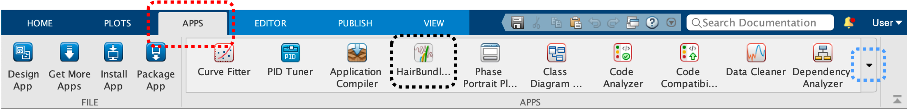

Copyright © 2024. The Regents of the University of Michigan. 
[Grosh Lab](https://sites.google.com/a/umich.edu/groshlab/home), Mechanical Engineering. 
This project is licensed under the terms of the BSD 3-clause license. 

# HairBundleLab

HairBundleLab is a specialized software designed to simulate the response of mammalian cochlear hair bundles (HBs), critical mechanosensory structures within the inner ear responsible for transducing sound, a mechanical input, into electrical signals processed by the brain. In inner hair cells, HB deflection marks the final mechanical step before neural activation, while in outer hair cells, it functions as the gain control mechanism in the cochlear amplifier, a process essential for normal hearing.

This software enables users to numerically investigate the complexities of cochlear HB responses to step-like stimuli. Whether applying force-input mechanisms such as fluid-jets or displacement inputs like stiff probes, HairBundleLab provides a comprehensive platform for exploring and visualizing these intricate processes.

**Core Features**: The software comprises an intuitive graphical user interface (GUI) developed in MATLAB App Designer and the raw codes. The software empowers users to:
* Design custom HB models by modifying geometric, mechanical, and electrical parameters to align with specific experimental requirements.
* Visualize HB displacements and mechano-electric transducer currents in real time, offering valuable insights into HB behavior in the time domain.

The comprehensive [documentation](resources/HairBundleLab_Documentation.pdf) serves as your go-to tutorial, guiding you step-by-step through the app interface. You will discover what each parameter represents, how to modify them effectively and gain insights through detailed illustrations and practical examples. Whether you're a seasoned researcher or a curious learner, HairBundleLab is designed to enhance your understanding and facilitate your research in auditory science with ease and precision. A brief [summary](#what-are-the-system-requirements-for-using-hairbundlelab) to get you started is also provided below. The [instructions](#using-the-raw-code) on how to use the raw codes are provided at the end. Note that HairBundleLab can also be downloaded from MATLAB [File Exchange](https://www.mathworks.com/matlabcentral/fileexchange/178699-hairbundlelab-the-mammalian-hair-bundle-response-simulator).

## What are the System Requirements for using HairBundleLab?

This section details the essential system requirements needed to run HairBundleLab on your computer. Please ensure that your system meets the following criteria. Below is a list of the mandatory software required for the installation and operation of the application:

* **MATLAB**: The software was developed using MATLAB 2024b and requires a licensed MATLAB installation to run.
* **MATLAB Symbolic Math Toolbox**: The software employs various symbolic functions to solve for the bundle geometry and perform nonlinear analysis, including nonlinear geometry. Therefore, the Symbolic Math Toolbox must be installed in your MATLAB environment.
* **MATLAB Parallel Computing Toolbox** (not mandatory, but recommended): This toolbox is used in the background to run multiple simulations simultaneously, improving efficiency and reducing computation time. For instance, if you want to analyze responses to multiple force or displacement amplitudes, parallel computing can significantly shorten the total time required. The simulation time will vary based on the number of GPUs in your machine and the number of workers allocated for parallel computing in MATLAB. By default, the HairBundleLab has parallel computing turned ON, but this setting can be turned OFF if needed. If your MATLAB license does not include this toolbox, refer to
    * **For GUI**: Section 2.2 and Section 4.4 of the [documentation](resources/HairBundleLab_Documentation.pdf) for more information or read [instructions](#what-if-i-do-not-have-matlab-2024b-or-later) below.
    * **For raw code**: Read how to modify the file <code>rkSolver.m</code> or <code>Probe_rkSolver.m</code> after their respective descriptions in the [instructions](#using-the-raw-code) for using the raw codes.

### What if I do not have MATLAB 2024b or later?
If you are using an older version of MATLAB, you can still use HairBundleLab, although some formatting may not render correctly. For instance, the symbol $\mu$ might appear as \mu, or subscripts/superscripts (e.g., $l1gs$ instead of $l_{1}^{gs}$) might not display properly. Functionally, the simulation would operate without issues.

Parallel computing has been supported in MATLAB since 2004, so any version released after 2004 can perform parallel computing. If you do not have the Parallel Computing Toolbox included with your MATLAB license, you can still run the GUI by following the instructions briefly mentioned in Section 2.2 and detailed in Section 4.4 of the [documentation](resources/HairBundleLab_Documentation.pdf). To check which toolboxes are included with your MATLAB installation, refer to Snippet 2.1 in Chapter 2 of the [documentation](resources/HairBundleLab_Documentation.pdf) for the necessary code lines to input in the command window. For the raw codes, as mentioned before, read how to modify the file <code>rkSolver.m</code> or <code>Probe_rkSolver.m</code> after their respective descriptions in the [instructions](#using-the-raw-code) for using the raw codes.

### What if I do not have the Parallel Computing Toolbox?
If you do not have the Parallel Computing Toolbox, you can easily disable parallel computing within the GUI. Simply open it and press the button marked  to disable parallel computing. When the button changes color to red, as shown by , parallel computing is turned OFF. You can press the button again to re-enable parallel computing. For more detailed information on each button in the GUI, please refer to Section 4.4 of the [documentation](resources/HairBundleLab_Documentation.pdf).

## Using the GUI

### Setting Up HairBundleLab
Once you have verified that your system meets all necessary requirements, you are ready to download and install HairBundleLab.

#### Downloading the GUI
To download the GUI, navigate to [app](toolbox/app) folder inside the [toolbox](toolbox) folder. Alternately, you can download the repository by visiting the [GitHub repository](https://github.com/vgoyal24/HairBundleLab). Click on the  button above. From the drop-down menu, click on <code>Download ZIP</code> and save it in your preferred folder. Once you unzip the downloaded file, navigate to <code>toolbox/app</code>, and you can find the installation file named <code>HairBundleLab.mlappinstall</code> inside. 

#### Installing the GUI
After downloading the file, navigate to the folder where it was saved and double-click on it. This will open MATLAB (if it is not already running) and prompt you to install the GUI under `My Apps`, as shown below in the figure and also in Fig. 3.1 of the [documentation](resources/HairBundleLab_Documentation.pdf). Click the `Install` button, and the installation should complete in under a minute.

    

#### Opening the GUI/App
Once installed, you can run HairBundleLab by following these steps, each time you wish to open the app:
<ol>
    <li>Open MATLAB.</li>
    <li>Navigate to the <code>APPS</code> tab in the MATLAB navigation bar, as highlighted by the red dotted box in the figure below and in Fig 3.2 of the <a href="resources/HairBundleLab_Documentation.pdf">documentation</a>.
        

            
        

    </li>
    <li>Click on <code>HairBundleLab</code> to execute it, indicated by the black dotted box in the above figure or in Fig. 3.2. If you do not see it, expand the list of installed apps using the drop-down arrow located within the blue dotted box.</li>
</ol>

By following these instructions, you should be able to download, install, and run HairBundleLab without any issues. For further details on app functionalities and more specific instructions, please refer to the [documentation](resources/HairBundleLab_Documentation.pdf).

### Navigating through HairBundleLab
A detailed description with illustrations is provided in the [documentation](resources/HairBundleLab_Documentation.pdf) for HairBundleLab, explaining the different components of the app. For example, how to define the mechanical, electrical, and geometric properties, and what properties of the bundle can be changed in the app. Please review Chapter 4 of the [documentation](resources/HairBundleLab_Documentation.pdf) to understand what each parameter means and where to modify these parameters in the app. 

### Running HairBundleLab
In Chapter 5 of the [documentation](resources/HairBundleLab_Documentation.pdf), we describe how to run the app once all the parameters are defined, along with an example using the default parameters for you to visualize the response of your HB. At the end of this chapter, you can find some tips and tricks, which we have detailed in Section 5.3 under miscellaneous information.

## Using the Raw Code
If you prefer not to use our application but are comfortable working directly with raw code for greater customization or integration into your projects, you can utilize the contents of the [rawCode](toolbox/rawCode/) folder. In this folder, the main file you need to open in MATLAB is <code>ThreeStBundle_Index.m</code>, which allows you to run the model with preset parameters. Below is a detailed description of each file in the folder:
* <code>ThreeStBundle_Index.m</code>: This is the primary script file where you can specify input properties and numerical simulation parameters, such as time steps. Additionally, you can customize the initial time for which the static force is applied to the system, a feature not yet available in the application (for more details, refer to Section 4.3 of the [documentation](resources/HairBundleLab_Documentation.pdf)). This file also offers customization options for your plots.
* <code>geometryNL.m</code> This function is crucial for defining the HB geometry, including radii, lengths, and related quantities, which are saved in the <code>geom</code> structure. The file computes all geometric relationships between different stereocilia as both symbolic and mathematical functions, stored in the <code>func</code> structure. 
* <code>HB_params.m</code>: This important function file allows you to define all mechanical and electrical parameters, saved in the <code>param</code> structure. It is likely you will modify this file frequently when designing your HB.
* <code>forceTime.m</code>: This function defines the force matrix, which has dimensions of $m\times n$, where $m$ represents the number of force amplitudes you simulate, and $n$ represents the force values over time.
* <code>probability.m</code>: Unless you wish to modify the Boltzmann functions for modeling channel open probability, you do not need to change this file. It utilizes parameters from <code>geom</code>, <code>func</code> and <code>param</code>.
* <code>rkSolver.m</code>: This function contains a custom Runge-Kutta fourth-order numerical solver. It uses parameters defined in the previously mentioned files and applies the three equations of motion derived in the research to predict the HB response. This is also the file you need to modify if you do not have a Parallel Computing Toolbox license from MATLAB or if you choose not to use it. In <code>line 41</code>, simply change <code>parfor</code> to <code>for</code>.
* <code>Probe_rkSolver.m</code>: Similar to <code>rkSolver.m</code>, this file includes slightly modified equations of motion due to the addition of the probe. In case you do not wish to use or have the Parallel Computing Toolbox, you can modify <code>line 42</code> by replacing <code>parfor</code> with <code>for</code>.
* <code>bundleVisual.m</code>: This function file is used for visualizing your HB. It is employed in <code>ThreeStBundle_Index.m</code> to plot the HB and typically does not require direct editing unless you are curious about its implementation.

## Release Notes
### v1.1
Release date: 01-08-2025

* Fixed an issue with data export feature in the app in older MATLAB versions.

### v1.0
Release date: 01-07-2025

* Initial release.

## Contribute or Contact Us
If you encounter any problems during any step of the installation process or while using the GUI and the raw codes or anything else related to HairBundleLab, please read through [CONTRIBUTING.md](CONTRIBUTING.md).
