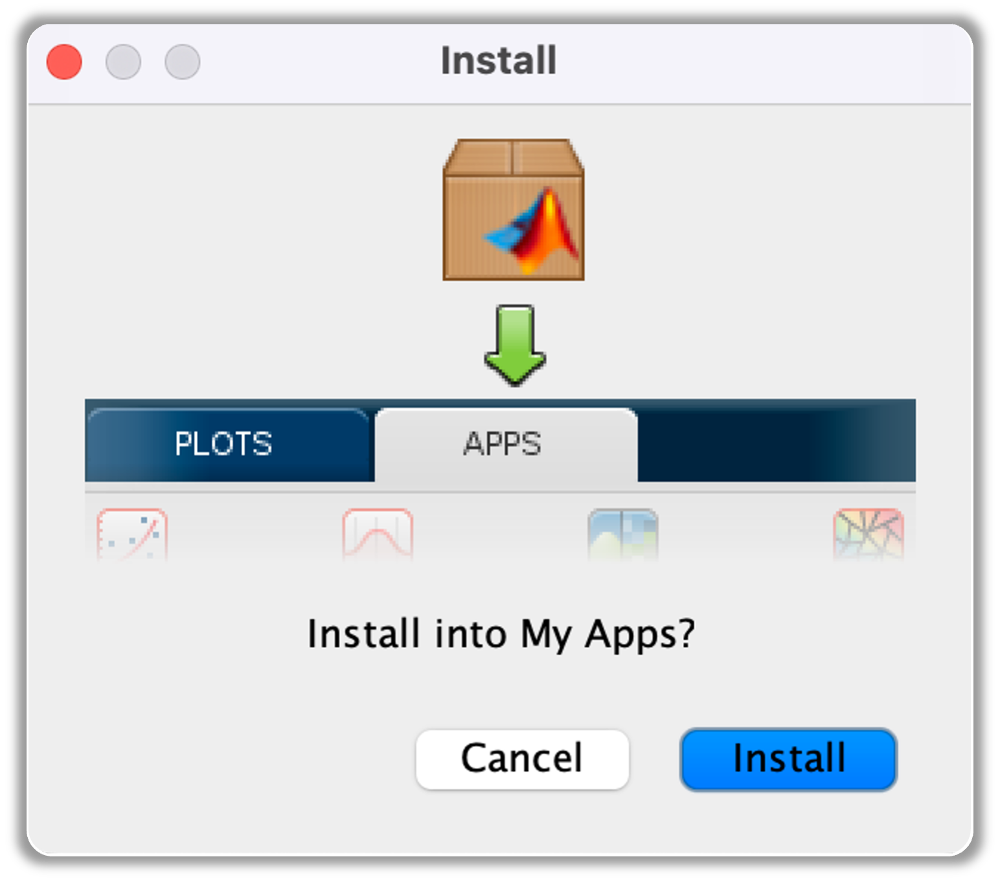

Copyright © 2024. The Regents of the University of Michigan.

# HairBundleLab

Welcome to HairBundleLab, your ultimate numerical tool for exploring the complexities of mammalian cochlear hair bundle (HB) responses to step-like stimuli. Whether you're using force input mechanisms like fluid-jets or displacement inputs such as rigid probes, HairBundleLab offers a platform to understand and visualize these intricate processes.

With HairBundleLab, you are not just observing, you are in control. Craft your own HB models, tailoring them precisely by adjusting geometrical, mechanical, and electrical parameters to suit your experimental needs. The app provides you with an in-depth look at HB behavior, offering real-time visualizations of displacements and mechano-electric transducer (MET) currents in the time domain.

The comprehensive [documentation](resources/HairBundleLab_Documentation.pdf) serves as your go-to tutorial, guiding you step-by-step through the app's interface. You will discover what each parameter represents, how to modify them effectively, and gain insights through detailed illustrations and practical examples. Whether you're a seasoned researcher or a curious learner, HairBundleLab is designed to enhance your understanding and facilitate your research in auditory science with ease and precision. A brief summary to get you started is also provided below.

## What are the System Requirements for using HairBundleLab?

This section details the essential system requirements needed to run HairBundleLab on your computer. Please ensure that your system meets the following criteria. Below is a list of the mandatory software required for the installation and operation of the application:

* **MATLAB**: The application was developed using MATLAB 2024b and requires a licensed MATLAB installation to run.
* **MATLAB Symbolic Math Toolbox**: The application employs various symbolic functions to solve for the bundle geometry and perform nonlinear analysis, including nonlinear geometry. Therefore, the Symbolic Math Toolbox must be installed in your MATLAB environment.
* **MATLAB Parallel Computing Toolbox** (not mandatory, but recommended): This toolbox is used in the background to run multiple simulations simultaneously, improving efficiency and reducing computation time. For instance, if you want to analyze responses to multiple force or displacement amplitudes, parallel computing can significantly shorten the total time required. The simulation time will vary based on the number of GPUs in your machine and the number of workers allocated for parallel computing in MATLAB. By default, the HairBundleLab has parallel computing turned ON, but this setting can be turned OFF if needed. If your MATLAB license does not include this toolbox, refer to Section 2.2 and Section 4 for more information.

### What if I don't have MATLAB 2024b or later?
If you are using an older version of MATLAB, you can still use HairBundleLab, although some formatting may not render correctly. For instance, the symbol $\mu$ might appear as \mu, or subscripts/superscripts (e.g., $l1gs$ instead of $l_{1}^{gs}$) might not display properly. Functionally, the simulation would operate without issues.

Parallel computing has been supported in MATLAB since 2004, so any version released after 2004 can perform parallel computing. If you do not have the Parallel Computing Toolbox included with your license, you can still run the app by following the instructions briefly mentioned in Section 2.2 and detailed in Section 4.4. To check which toolboxes are included with your MATLAB installation, refer to Snippet 2.1 in Chapter 2 of the documentation for the necessary code lines to input in the command window.

### What if I don't have the Parallel Computing Toolbox?
If you do not have the Parallel Computing Toolbox, you can easily disable parallel computing within the application. Simply open the app and press the button marked  to disable parallel computing. When the button changes color to red, as shown by , parallel computing is turned OFF. You can press the button again to re-enable parallel computing. For more detailed information on each button in the application, please refer to Section 4.4.

## Setting Up HairBundleLab
Once you have verified that your system meets all necessary requirements, you are ready to download and install HairBundleLab. If you are reading this document from a non-official source, make sure to go to our official lab website to download the installation file.

### Downloading the Application
To download the application, visit the [GitHub repository](https://github.com/vgoyal24/HairBundleLab). Click on the  button above. From the drop-down menu, click on <code>Download ZIP</code> and save it in your preferred folder. Once you unzip the downloaded file, open the folder named <code>app</code> and you can find the installation file named <code>HairBundleApp.mlappinstall</code> inside. 

### Installing the Application
After downloading the file, navigate to the folder where it was saved and double-click on it. This will open MATLAB (if it is not already running) and prompt you to install the app under `My Apps`, as shown below in the figure and also in Fig. 3.1 of the [documentation](resources/HairBundleLab_Documentation.pdf). Click the `Install` button, and the installation should be completed in under a minute.

    

### Opening the Application
Once installed, you can run HairBundleLab by following these steps, each time you wish to open the app:
<ol>
    <li>Open MATLAB.</li>
    <li>Navigate to the <code>APPS</code> tab in the MATLAB navigation bar, as highlighted by the red dotted box in the figure below and in Fig 3.2 of the <a href="resources/HBL_Documentation">documentation</a>.
        

            
        

    </li>
    <li>Click on <code>HairBundleApp</code>code> to execute it, indicated by the black dotted box in the above figure or in Fig. 3.2. If you do not see it, expand the list of installed apps using the drop-down arrow located within the blue dotted box.</li>
</ol>

By following these instructions, you should be able to download, install, and run HairBundleLab without any issues. For further details on app functionalities and more specific instructions, please refer to the [documentation](resources/HairBundleLab_Documentation.pdf).

## Navigating through HairBundleLab
A detailed description with illustrations is provided in the [documentation](resources/HairBundleLab_Documentation.pdf) for HairBundleLab explaining the different components of the application. For example, how to define the mechanical, electrical, and geometric properties, and what properties of the bundle can be changed in the app. Please review Chapter 4 of the [documentation](resources/HairBundleLab_Documentation.pdf) to understand what each parameter means and where to modify these parameters in the application. 

## Running HairBundleLab
In Chapter 5 of the [documentation](resources/HairBundleLab_Documentation.pdf), we describe how to run the application once all the parameters are defined along with an example using the default parameters for you to visualize the response of your hair bundle. At the end of this chapter, you can find some tips and tricks which we have detailed in Section 5.3 under miscellaneous information.
    
